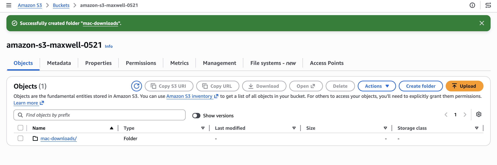
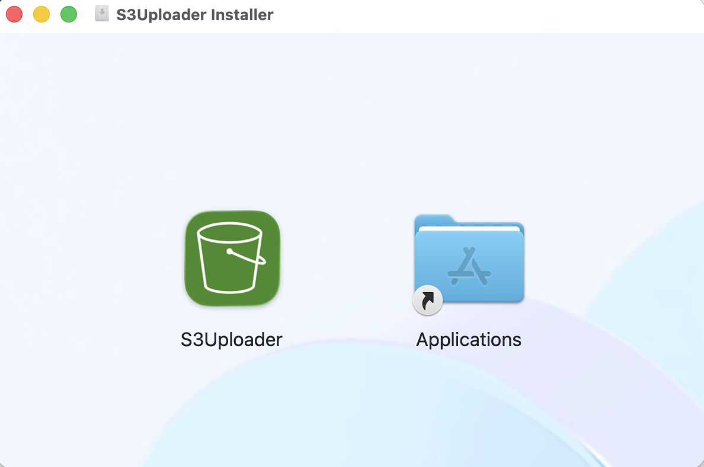
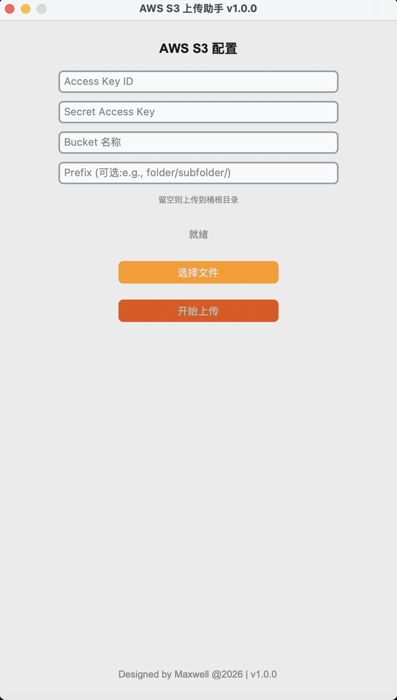
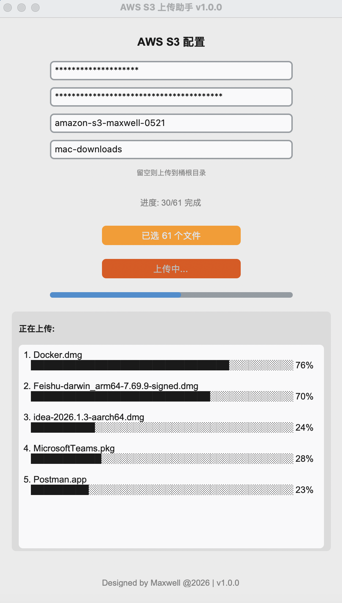
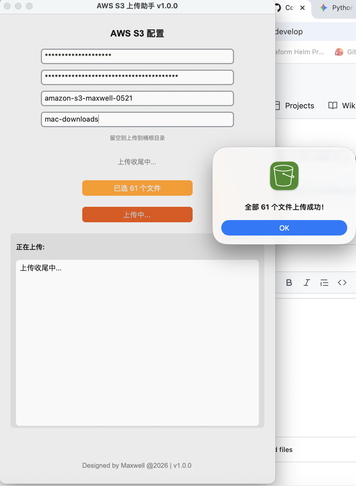

# s3-uploader-app
In this demo, I will use python to develop one Mac OS app to upload files to AWS S3,

the app will use concurrency process so that can get a high performance and speed up 

for the .app files since it's a directory then will be automatically zipped then upload 


## Usage

- create an amazon s3 bucket 

- you can uncheck block pulbic 

- assign one policy for public access 

bukect policy

```shell
{
    "Version": "2012-10-17",
    "Statement": [
        {
            "Sid": "PublicReadGetObject",
            "Effect": "Allow",
            "Principal": "*",
            "Action": "s3:GetObject",
            "Resource": "arn:aws:s3:::amazon-s3-maxwell-0521/*"
        }
    ]
}

```

- create a folder in S3 we also call folder path the prefix



- Download the install file from releases



- Here's the APP runs like 



- fill your AWS credentials and S3 bucket info then select the files you need to upload to S3 



- this is upload completed app screenshot 




